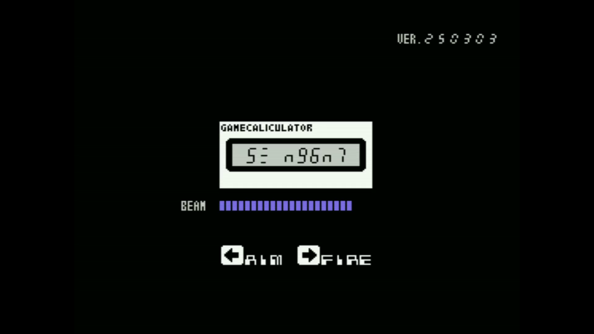

[ [Engligh](README.md) | [日本語](README.ja.md) ]

---
# DIGIAL INVADER for MSX



<br>

## Overview

- This is a MSX reproduction of the "Digital Invader" game from the [Casio SL-880](https://www.casio.com/jp/basic-calculators/product.SL-880/).
- There are some differences in details, but the basic rules are the same.

<br>

## Play in WebMSX

- Please access the following URL.

    - C Language version

    https://webmsx.org/?MACHINE=MSX1&CARTRIDGE1_URL=https://github.com/aburi6800/msx-digitalinvader/raw/main/dist/dgtl-inv.rom

    - MSX-BASIC verison

    https://webmsx.org/?MACHINE=MSXTRJ&DISKA_URL=https://github.com/aburi6800/msx-digitalinvader/raw/main/DGTL-INV.dsk

<br>

## How to play

### Control

- Cursor keys left / Joypad left
    - Aiming
- Cursor key right / Joypad right
    - Beam
- Spacebar / Trigger button
    - Game Start
    - Beam

<br>

### Rules

- Press SPACE key to start the game.
- Press the AIM key to set the number. Each time the key is pressed, the number increases from "0" to "9". Next comes "n" and pressing the key again returns the number to "0".
- When you press the FIRE key, a digital invader with the same number as you is shot down. If there is a digital invader with the same number, press the key again.
- There are 16 digital invaders attacking in one round. The beam cannon can be used 30 times.
- When the total number of erased numbers is a multiple of 10, a UFO("n") appears.If you shoot it down, you will get a bonus of 300pts.
- When invaded by digital invaders, the player loses one life.
- The game is over when the life reaches zero or all 30 beam cannons are used up in one round.

<br>

## Build from C-source

- It is assumed that `z88dk` and `cmake` are installed.
- Please refer to the following link for `z88dk`.

    [z88dk installation](https://github.com/z88dk/z88dk/wiki/installation)

- If `cmake` is not installed, use the following command to install it.
    ```
    sudo apt install cmake
    ```

<br>

- For the first time only, go to the cloned directory and execute the following command.
    ```
    mkdir build
    (cd build && cmake -DCMAKE_TOOLCHAIN_FILE=../cmake/z88dk.cmake ..)
    ```

<br>

- Next, the following command will create a `degi-inv.rom` file in the `dist` directory.
    ```
    cd build
    make clean && make
    ```

<br>

## Release notes

ver.20250304
- Code Refactor
- Make it possible to shoot a beam even with a trigger

ver.20250303-2
- Clean up around sound data and playback processing

ver.20250303
- add screen display of remaining number of beams
- support for joystick
- slow increase in difficulty

ver.20250302-2
- Fix a bug that game over does not occur even if the number of beam ammunition runs out

ver.20250302
- Release version released

ver.20250301
- Prototype version (sound not supported) released

<br>

## License

MIT License

<br>

## Thanks

- [Z88DK - The Development Kit for Z80 Computers](https://github.com/z88dk/z88dk)
- [C-BIOS](http://cbios.sourceforge.net/)
- [openMSX](https://openmsx.org/)
- [nMSXtiles](https://github.com/pipagerardo/nMSXtiles)
- [WebMSX](https://github.com/ppeccin/WebMSX)
- [MSXPen](https://msxpen.com/)
